<p align="center">
  
</p>

<h1 align="center">Offline Study Assistant</h1>

<p align="center">
  Ask questions about your course PDFs and get answers that cite their pages, <b>fully offline</b>.<br>
  Search and generation both run on the phone. Tap a citation to open the PDF at that page.
</p>

<p align="center">
  <a href="https://github.com/dhafer123/Offline_RAG_study_assistant/actions/workflows/ci.yml"></a>
</p>

<p align="center">
  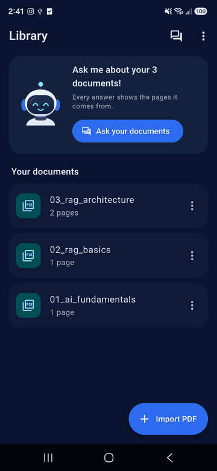
</p>

<p align="center"><sub>Recorded on a Samsung Galaxy A16 (4 GB RAM), release build, airplane mode. The ~20 s wait is sped up ×5.</sub></p>

| Welcome | Library | Cited answer | Source page |
|---|---|---|---|
| 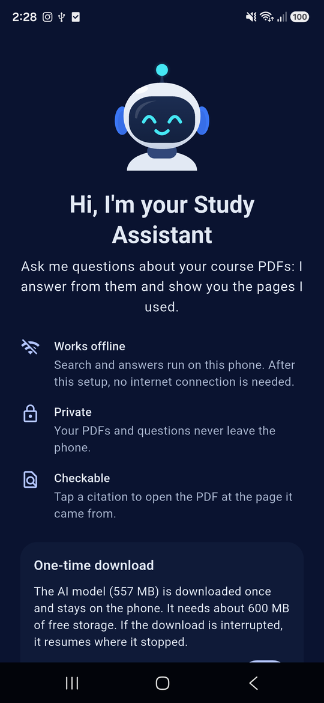 | 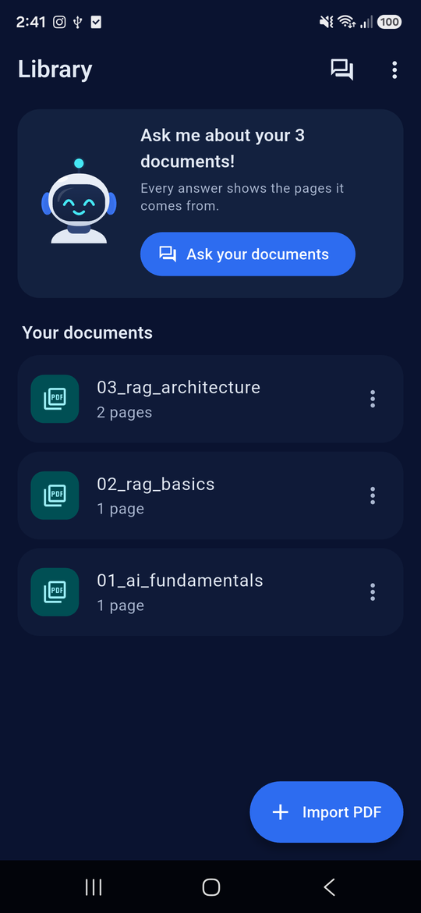 | 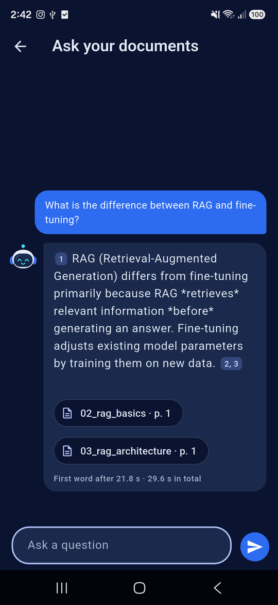 | 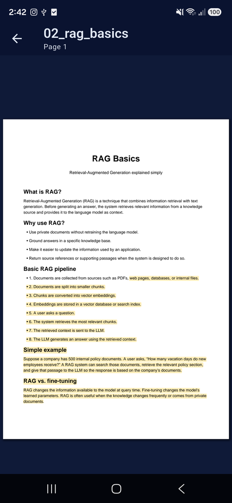 |

## What it does

- **Import course PDFs.** They are read, split into passages and indexed on the phone, in the background.
- **Ask in English or French.** The app retrieves the most relevant passages and an on-device LLM (Gemma 3 1B) answers from them only, in the question's language.
- **Check every answer.** `[n]` markers become citation chips (document + page); tapping one opens the PDF at that page with the passage highlighted.
- **Say "not found".** Questions with no close passage are refused before the LLM runs.
- **No network at runtime.** The only connection is the one-time model download. No analytics, no cloud API.

A small assistant bot shows what's happening: searching, thinking during the ~17 s the model takes to read the sources, answering, or confused when nothing was found.

## Architecture

Three layers, all on the device. Screens never touch the AI or storage packages directly: each sits behind an interface in `lib/core/`, so it can be faked in tests.

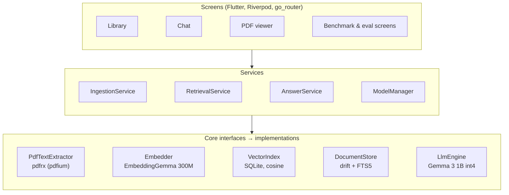

**Indexing a PDF**

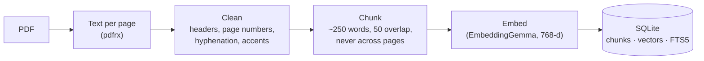

Cleaning and chunking run in a background isolate; pdfium, embedding and SQLite already run off the UI thread.

**Answering a question**

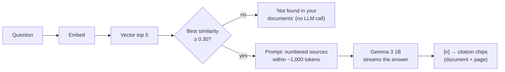

Design choices that came from measurements ([docs/METRICS.md](docs/METRICS.md)):

- **Vector search only.** Hybrid search (vector + BM25 fused with RRF) scored 84% Recall@5 against 90% for vectors alone: half the questions are asked in the other language than the course, and keyword search can't bridge that. The hybrid code stays, behind `RetrievalMode.hybrid`.
- **A 1,000-token prompt budget.** The model file prefills in fixed sizes (256, 512, 1,024, 2,560 tokens). Time to the first word is a staircase: ~17 s up to 1,024 tokens, ~44 s above. Three to four sources fit in the 1,024 step.
- **CPU, not GPU.** On a 4 GB phone the GPU backend was killed for memory at the first decode step.

## Results

All numbers from a **Samsung Galaxy A16** (SM-A165F, MediaTek Helio G99, 4 GB RAM, Android 16), release build, LLM on CPU. Details, method and dates in [docs/METRICS.md](docs/METRICS.md).

| | Result |
|---|---|
| **Answer speed** | **17.0 s** to the first word (median, 56 answers), then **8.3 tokens/s**; 21.5 s per answer |
| **Retrieval** | **Recall@5 90%** (45/50), MRR 0.687, 2.4 s per question; hybrid 84%, keyword only 60% |
| **Answer quality** | **21/50 correct**, 9 partial, 15 wrong, 5 declined; citations support the answer in 14 of 22 cited answers* |
| **Refusals** | 3 of 10 unanswerable questions declined (2 by the similarity gate)* |
| **Indexing** | 2.35 s per passage; a 120-page PDF in 5 min 11 s, with 0.18% janky frames meanwhile |
| **Memory** | ~1.17 GB peak with the LLM, 1.59 GB with the LLM and the embedder loaded |
| **Model** | Gemma 3 1B int4, 557 MB; loads in 0.86 s |

<sub>*Eval set: 50 answerable + 10 unanswerable questions over 5 course PDFs, 31 English / 29 French ([eval/questions.json](eval/questions.json)), with a 120-page unrelated report indexed as a distractor. The questions and the answer grades were written by Claude at the author's request and checked by script against the PDFs; see the safeguards in METRICS.md.</sub>

<p align="center">
  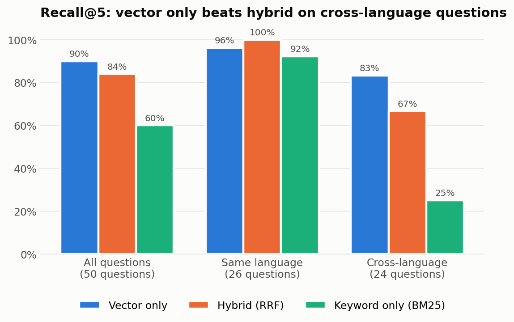
  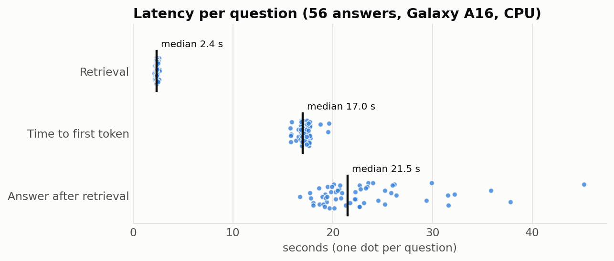
  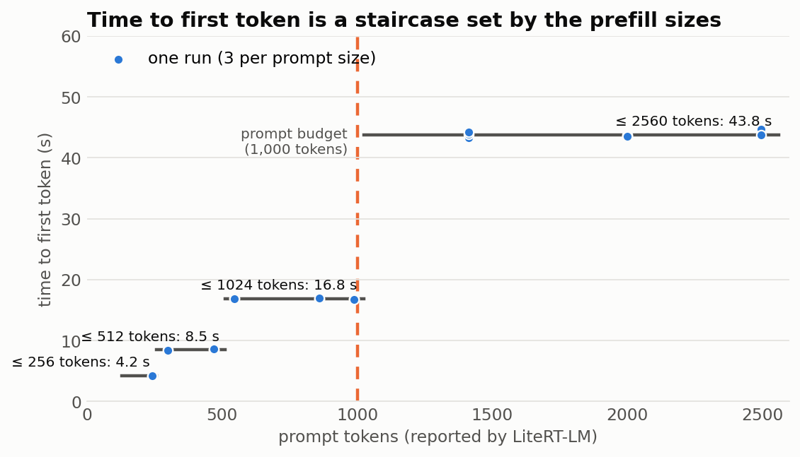
</p>

**What the numbers say.** Retrieval works: when the right page reaches the prompt, the 1B model gets the answer right or partly right in 28 of 41 cases. The model is the weak link: it answers English questions much better than French ones (15/26 vs 6/22 correct), often leaves out the citations it's asked for, and invents answers to 7 of the 10 unanswerable questions. These are the targets for v2. The charts come from [eval/analyze.ipynb](eval/analyze.ipynb).

## Run it

**Requirements:** Flutter 3.38.9 (Dart 3.10) and an Android phone; 4 GB of RAM is enough. The iOS project exists but hasn't been built or tested.

```bash
flutter pub get
flutter run --release        # measure performance in release mode only
```

Generated files (`*.g.dart`) are committed. After changing a provider, regenerate them:

```bash
dart run build_runner build --force-jit --delete-conflicting-outputs
```

### Model files

The app downloads the LLM on first launch (557 MB, Wi-Fi only by default), checks its SHA-256 and resumes interrupted downloads. **The file isn't published on the [`models-v1` release](https://github.com/dhafer123/Offline_RAG_study_assistant/releases/tag/models-v1) yet**, and the embedding model isn't downloaded by the app yet either, so for now copy the files by hand:

1. Request access on Hugging Face (Gemma models are gated) and download:
   - [litert-community/Gemma3-1B-IT](https://huggingface.co/litert-community/Gemma3-1B-IT): `Gemma3-1B-IT_multi-prefill-seq_q4_ekv4096.litertlm`
   - [litert-community/embeddinggemma-300m](https://huggingface.co/litert-community/embeddinggemma-300m): `embeddinggemma-300M_seq512_mixed-precision.tflite` and `sentencepiece.model`
2. Install a debug build once (`flutter run`; `run-as` needs a debuggable app), then copy each file:

```bash
P=com.dhafer.offline_study_assistant
for F in Gemma3-1B-IT_multi-prefill-seq_q4_ekv4096.litertlm \
         embeddinggemma-300M_seq512_mixed-precision.tflite sentencepiece.model; do
  adb push "$F" /data/local/tmp/"$F"
  adb shell chmod 644 /data/local/tmp/"$F"
  adb shell run-as $P mkdir -p files/models
  adb shell run-as $P cp /data/local/tmp/"$F" files/models/"$F"
  adb shell rm /data/local/tmp/"$F"
done
```

On Git Bash for Windows, run `export MSYS_NO_PATHCONV=1` first so the device paths aren't rewritten. The files survive reinstalls (`flutter run --release` uses the same debug signing key) but not an uninstall.

Gemma is provided under and subject to the Gemma Terms of Use found at ai.google.dev/gemma/terms (see [docs/model_license](docs/model_license/)).

### Use it

1. **Library → Import PDF**, pick a course PDF. It's copied into the app and indexed in the background (about 2.3 s per passage). Scanned PDFs (pages that are only images) can't be read yet.
2. **Ask your documents**, type a question. The first answer also loads the model (~2 s).
3. Tap a **page chip** to open the PDF at the cited page, or a small **[n]** marker to read the passage.

### Measure it

The measurement screens are in the Library's **⋮** menu and work in release builds:

- **LLM benchmark:** load time, time to first token and tokens/s over 10 runs, plus a sweep of prompt sizes.
- **Retrieval debug → eval:** runs every question of `eval/questions.json` through retrieval (vector, keyword or hybrid) and reports Recall@5 and MRR.
- **Retrieval debug → answer eval:** runs all 60 questions through the full pipeline.
- **Bot preview:** every mood of the assistant bot.

Results are saved as JSON where `adb` can read them without `run-as`:

```bash
adb pull /sdcard/Android/data/com.dhafer.offline_study_assistant/files/eval_results/ eval/results/
python eval/anonymize_results.py ...   # before committing an answer export, see the script
```

Timings are also logged: `adb logcat -s flutter | grep "\[perf\]"`.

## Development

```bash
flutter analyze
flutter test                 # 364 tests
```

CI runs formatting, the generated-files check, `flutter analyze` and `flutter test` on every push.

```
lib/
  app/        router, theme, providers, shared widgets (assistant bot, empty states)
  core/       interfaces + implementations: ai/ (LLM, embedder, model download), db/, pdf/
  features/   library/ (ingestion, cleaner, chunker), chat/ (retrieval, RRF, prompt, citations),
              viewer/, model_setup/, benchmark/
test/         mirrors lib/
eval/         questions.json, analyze.ipynb, results/
tool/         fixture PDF and app icon generators
docs/         METRICS.md, charts, screenshots
```

Pure logic (text cleaner, chunker, RRF, prompt builder, citation parser, the bot's moods) is unit-tested; screens are tested with fake engines.

## v2

- **Better answers in French**, and a stricter "not found" (test a larger or newer model, per-sentence citations), checked on new questions.
- **Download the embedding model** in the app, and publish the model files, so a fresh install works without adb.
- **Smaller APK**: split per ABI or ship an app bundle (the universal APK is 303 MB, mostly native libraries).
- **Faster indexing**: the embedder runs on one core (2.35 s per passage); a newer flutter_gemma could use more threads or the GPU.
- **OCR for scanned PDFs** (ML Kit text recognition).
- **Flashcards and quizzes** generated from a chapter.
- **Chat history per course**, with multi-turn follow-ups.
- **Arabic and Darija** questions.

## License

The code is under the [MIT License](LICENSE). The Gemma models are not part of this repository and are subject to the [Gemma Terms of Use](https://ai.google.dev/gemma/terms).
